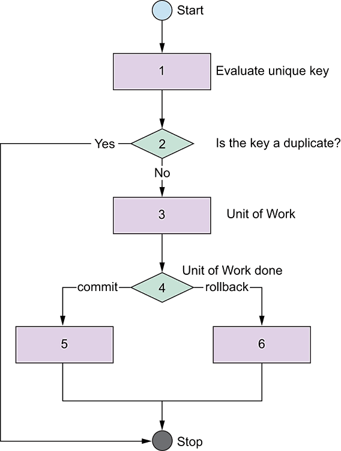

## Idempotent requests

To ensure you can safely retry requests without accidentally performing the same operation twice, all of our transaction endpoints support *idempotency*. API idempotency is useful in case your requests are disrupted in transit or you otherwise fail to receive a response.

<aside class="notice">When idempotency is enabled, multiple invocations will not duplicate the transaction.</aside>

For example, if a request to the [**EFT Fund endpoint**](https://docs.vopay.com/v2/vopay-api-reference/ref#eftfundget) does not respond due to a network connection error, you can retry the `FUND` request with the same **idempotency key**, thereby guaranteeing that not more than one funding transaction will have been created.

{.autocaption}

An idempotency key is a unique key of your choosing which the server can use to recognize and reject subsequent retries of the same request. To perform an idempotent request, provide an `IdempotencyKey` in the body of the `POST` request.

<aside class="notice">The specific implementation of generating the unique value is up to you. It can be as simple as just an ordinal number (1, 2, 3, &hellip;) or as complex as a hash of critical details.</aside>
