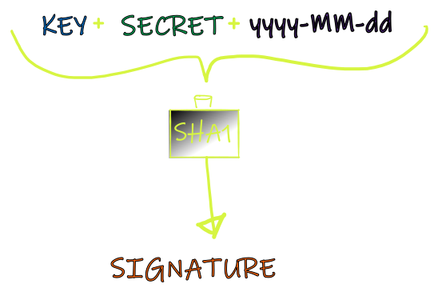

## Authentication

You will use the **account ID**, **API key** and a **signature** to authenticate each API request.

<aside class="notice">When your account is activated, VoPay sends you an email containing your account ID, shared secret, and API key.</aside>

To generate the signature, concatenate your API key and shared secret together with the current date, then hash the result using SHA1.

