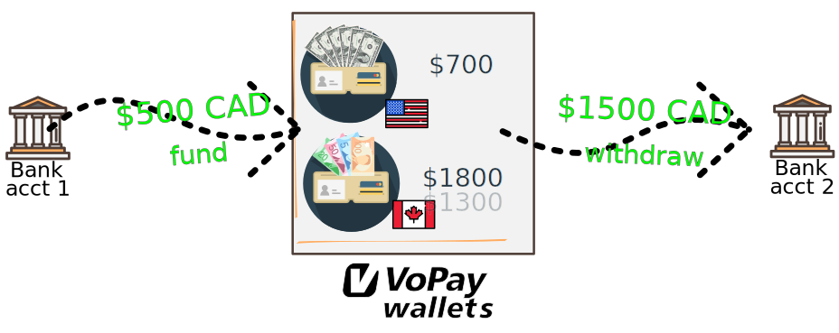

## Funds flow diagram

Consider the two wallets from the above section: $1,300 CAD, $700 USD. In this case, attempting to make an electronic funds transfer of $1,500 CAD would fail.

{.autocaption}

This situation can be remedied by funding your wallet in your target currency prior to the transaction.

{.autocaption}
