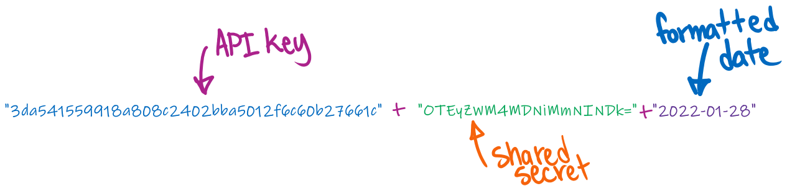
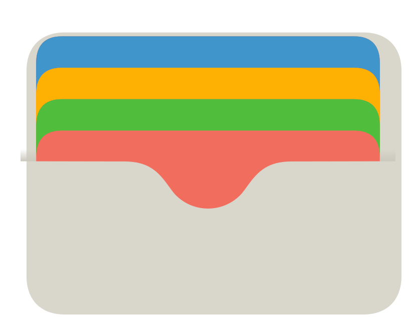

## Getting Started

This guide will show you how to achieve programmatic financial transactions using VoPay's API's. To get a sense of outbound parameters and typical response content, you will make real queries and post transactions to a sandbox environment.

First, this guide will examine how each request is authenticated.


## Authentication

When your sandbox is activated, VoPay will send you an **account ID**,a  **shared secret**, and **API key**.

Concatenate the API key and the shared secret together with the current date, then hash the result using SHA1. This is your **signature**, which you will be daily re-calculating.

<aside class="notice">
Because the signature requires digesting the date, you need re-calculate it each day. That is why the signature should be a <em>method output</em> rather than a <em>constant</em> in your solution.
</aside>

---

By example, here is a shared secret and an API key with a current date:



These make the concatenated string:


Then, you will hash the resulting string using SHA1. For the example, the resulting hash is:

| Algorithm | Hash                                       |
|-----------|--------------------------------------------|
| SHA1      | `f69fe6fbd81b9008fbcc0ebdac5fc7a47e3beacf` |

### Coded tutorial

Prepare to use the **sandbox key** and **shared secret** assigned to you by VoPay.

<aside class="notice">
The sandbox is pre-populated with data to query. If you haven't already, <a href="https://vopay.com/api-sandbox/" target="_blank">request sandbox API credentials</a> with VoPay; then, substitute the credentials you receive into the code snippets.
</aside>

> Concatenation of the key, shared secret, and formatted date:

```powershell
$KEY = "3da541559918a808c2402bba5012f6c60b27661c"
$SECRET = "OTEyZWM4MDNiMmNINDk="
$formattedDate = Get-Date -Format "yyyy-MM-dd"
$PreSig = $KEY + $SECRET + $formattedDate
```

```shell
readonly KEY="3da541559918a808c2402bba5012f6c60b27661c"
readonly SECRET="OTEyZWM4MDNiMmNINDk="
formatted_date=$(date +%Y-%m-%d)
pre_sig=$KEY$SECRET$formatted_date
```

```python
KEY = "3da541559918a808c2402bba5012f6c60b27661c"
SECRET = "OTEyZWM4MDNiMmNINDk="
formatted_date = datetime.datetime.now().strftime("%Y-%m-%d")
pre_sig = KEY + SECRET + formatted_date
```

```js
const KEY = "3da541559918a808c2402bba5012f6c60b27661c"
const SECRET = "OTEyZWM4MDNiMmNINDk="
var formatted_date = new Date().toISOString().slice(0,10)
var pre_sig = KEY + SECRET + formatted_date
```

```ruby
KEY = "3da541559918a808c2402bba5012f6c60b27661c"
SECRET = "OTEyZWM4MDNiMmNINDk="
formatted_date = Date.today.strftime("%Y-%m-%d")
pre_sig = KEY + SECRET + formatted_date
```

```php
$KEY = "3da541559918a808c2402bba5012f6c60b27661c"
$SECRET = "OTEyZWM4MDNiMmNINDk="
$formattedDate = date("Y-m-d")
$PreSig = $KEY + $SECRET + $formattedDate
```

```csharp
const KEY = "3da541559918a808c2402bba5012f6c60b27661c"
const SECRET = "OTEyZWM4MDNiMmNINDk="
var formatted_date = DateTime.Now.ToString("yyyy-MM-dd")
var pre_sig = KEY + SECRET + formatted_date
```

```java
String KEY = "3da541559918a808c2402bba5012f6c60b27661c";
String SECRET = "OTEyZWM4MDNiMmNINDk=";
String formattedDate = new SimpleDateFormat("yyyy-MM-dd").format(new Date());
String authStr = KEY + SECRET + formattedDate;
```

```go
const KEY = "3da541559918a808c2402bba5012f6c60b27661c"
const SECRET = "OTEyZWM4MDNiMmNINDk="
var formatted_date = time.Now().Format("2006-01-02")
var pre_sig = KEY + SECRET + formatted_date
```

You will now perform a SHA1 cryptographic hash on this string.

> The SHA1 hash can be easily calculated in any shell.

```powershell
# You convert the concatenated string into a binary representation.
$PreSigChars = $PreSig.ToCharArray()
$PreSigBytes = $PreSigChars | ForEach-Object { [System.Convert]::ToByte($_) }
$PreSigStream = [IO.MemoryStream]::new($PreSigBytes)  # Note: Reading changes the stream position
# Then, you pass that to a hashing function.
$Hash = Get-FileHash -InputStream $PreSigStream -Algorithm SHA1
$Signature = $Hash.Hash.ToLowerInvariant()
```

```shell
signature=$(echo -n $pre_sig_str | sha1sum | awk '{print $1}')
```

```python
signature = hashlib.sha1(pre_sig.encode('utf-8')).hexdigest()
```

```js
var signature = crypto.createHash('sha1').update(pre_sig).digest('hex')
```

```ruby
signature = Digest::SHA1.hexdigest(pre_sig)
```

```php
signature = hash('sha1', pre_sig)
```

```csharp
// Using statements and class setup omitted for brevity
signature = SHA1.Create().ComputeHash(Encoding.UTF8.GetBytes(pre_sig)).ToHexString();
```

```java
// Import statements and class setup omitted for brevity
signature = MessageDigest.getInstance("SHA-1").digest(pre_sig.getBytes("UTF-8")).toHexString();
```

You will need this to authenticate every request.

[Later](#example-getting-account-balance), you will use the signature to receive sandbox data from VoPay.

## How VoPay works

To better appreciate the capabilities these API's unleash, a bird's-eye view of how VoPay works can be helpful.

### Fluid funds in your virtual wallet

VoPay's simple yet powerful API's enable you to securely fund and withdraw money from this virtual wallet. Any movement of funds can be accomplished through just a few lines of code:

- withdraw and deposit funds
  - from savings
  - from chequing accounts
- request payments
  - EFT
  - Interac
  - Visa, Mastercard, and Discover
- transfer or send money
- make bulk EFT's, e.g.:
  - payroll
  - property managers
  - shareholders
- *many more transactions*

Effectively, your VoPay account acts like a cloud-hosted virtual wallet.

### Sending money

Before making outbound transactions, wallets need to make funds available. To send money then, you will **fund** your wallet.



You can do this by making a `POST` request to the `/api/v2/eft/fund` endpoint. This endpoint debits funds from a bank account that you specify in the request parameters.

```shell
curl --request POST \
 --url https://earthnode-dev.vopay.com/api/v2/eft/fund \
 --form "AccountID={AccountID}" \
 --form "Key={Key}" \
 --form "Signature={Signature}" \
 --form "ClientAccountID={ClientAccountID}" \
 --form "FirstName={FirstName}" \
 --form "LastName={LastName}" \
 --form "CompanyName={CompanyName}" \
 --form "DOB={DOB}" \
 --form "PhoneNumber={PhoneNumber}" \
 --form "Address1={Address1}" \
 --form "City={City}" \
 --form "Province={Province}" \
 --form "Country={Country}" \
 --form "PostalCode={PostalCode}" \
 --form "AccountNumber={AccountNumber}" \
 --form "FinancialInstitutionNumber={FinancialInstitutionNumber}" \
 --form "BranchTransitNumber={BranchTransitNumber}" \
 --form "Amount={Amount}" \
 --form "Currency={Currency}" \
 --form "Iq11VerificationLevelID={Iq11VerificationLevelID}" \
 --form "ClientReferenceNumber={ClientReferenceNumber}" \
 --form "KYCPerformed={KYCPerformed}" \
 --form "KYCReferenceNumber={KYCReferenceNumber}" \
 --form "EmailAddress={EmailAddress}" \
 --form "IPAddress={IPAddress}" \
 --form "FlinksAccountID={FlinksAccountID}" \
 --form "FlinksLoginID={FlinksLoginID}" \
 --form "Token={Token}" \
 --form "PlaidPublicToken={PlaidPublicToken}" \
 --form "PlaidAccessToken={PlaidAccessToken}" \
 --form "PlaidAccountID={PlaidAccountID}" \
 --form "PlaidProcessorToken={PlaidProcessorToken}" \
 --form "InveriteRequestGUID={InveriteRequestGUID}" \
 --form "TransactionLabel={TransactionLabel}" \
 --form "Notes={Notes}" \
 --form "DelayBankingInfo={DelayBankingInfo}" \
 --form "IdempotencyKey={IdempotencyKey}"
```

```powershell
Invoke-RestMethod -Method Post -Uri "https://earthnode-dev.vopay.com/api/v2/eft/fund" -Body '{"AccountID":"$AccountID","Key":"$KEY","Signature":"$Signature","ClientAccountID":"$ClientAccountID","FirstName":"$FirstName","LastName":"$LastName","CompanyName":"$CompanyName","DOB":"$DOB","PhoneNumber":"$PhoneNumber","Address1":"$Address1","City":"$City","Province":"$Province","Country":"$Country","PostalCode":"$PostalCode","AccountNumber":"$AccountNumber","FinancialInstitutionNumber":"$FinancialInstitutionNumber","BranchTransitNumber":"$BranchTransitNumber","Amount":"$Amount","Currency":"$Currency","Iq11VerificationLevelID":"$Iq11VerificationLevelID","ClientReferenceNumber":"$ClientReferenceNumber","KYCPerformed":"$KYCPerformed","KYCReferenceNumber":"$KYCReferenceNumber","EmailAddress":"$EmailAddress","IPAddress":"$IPAddress","FlinksAccountID":"$FlinksAccountID","FlinksLoginID":"$FlinksLoginID","Token":"$Token","PlaidPublicToken":"$PlaidPublicToken","PlaidAccessToken":"$PlaidAccessToken","PlaidAccountID":"$PlaidAccountID","PlaidProcessorToken":"$PlaidProcessorToken","InveriteRequestGUID":"$InveriteRequestGUID","TransactionLabel":"$TransactionLabel","Notes":"$Notes","DelayBankingInfo":"$DelayBankingInfo","IdempotencyKey":"$IdempotencyKey"}'
```

```python
import requests
r=requests.post('https://earthnode-dev.vopay.com/api/v2/eft/fund',
                data={
                    'AccountID': '$AccountID',
                    'Key': '$KEY',
                    'Signature': '$Signature',
                    'ClientAccountID': '$ClientAccountID',
                    'FirstName': '$FirstName',
                    'LastName': '$LastName',
                    'CompanyName': '$CompanyName',
                    'DOB': '$DOB',
                    'PhoneNumber': '$PhoneNumber',
                    'Address1': '$Address1',
                    'City': '$City',
                    'Province': '$Province',
                    'Country': '$Country',
                    'PostalCode': '$PostalCode',
                    'AccountNumber': '$AccountNumber',
                    'FinancialInstitutionNumber': '$FinancialInstitutionNumber',
                    'BranchTransitNumber': '$BranchTransitNumber',
                    'Amount': '$Amount',
                    'Currency': '$Currency',
                    'Iq11VerificationLevelID': '$Iq11VerificationLevelID',
                    'ClientReferenceNumber': '$ClientReferenceNumber',
                    'KYCPerformed': '$KYCPerformed',
                    'KYCReferenceNumber': '$KYCReferenceNumber',
                    'EmailAddress': '$EmailAddress',
                    'IPAddress': '$IPAddress',
                    'FlinksAccountID': '$FlinksAccountID',
                    'FlinksLoginID': '$FlinksLoginID',
                    'Token': '$Token',
                    'PlaidPublicToken': '$PlaidPublicToken',
                    'PlaidAccessToken': '$PlaidAccessToken',
                    'PlaidAccountID': '$PlaidAccountID',
                    'PlaidProcessorToken': '$PlaidProcessorToken',
                    'InveriteRequestGUID': '$InveriteRequestGUID',
                    'TransactionLabel': '$TransactionLabel',
                    'Notes': '$Notes',
                    'DelayBankingInfo': '$DelayBankingInfo',
                    'IdempotencyKey': '$IdempotencyKey'
                })
```

```javascript
var options = {
 "method": "POST",
 "url": "https://earthnode-dev.vopay.com/api/v2/eft/fund",
 "formData": {
  "AccountID": "{AccountID}",
  "Key": "{Key}",
  "Signature": "{Signature}",
  "ClientAccountID": "{ClientAccountID}",
  "FirstName": "{FirstName}",
  "LastName": "{LastName}",
  "CompanyName": "{CompanyName}",
  "DOB": "{DOB}",
  "PhoneNumber": "{PhoneNumber}",
  "Address1": "{Address1}",
  "City": "{City}",
  "Province": "{Province}",
  "Country": "{Country}",
  "PostalCode": "{PostalCode}",
  "AccountNumber": "{AccountNumber}",
  "FinancialInstitutionNumber": "{FinancialInstitutionNumber}",
  "BranchTransitNumber": "{BranchTransitNumber}",
  "Amount": "{Amount}",
  "Currency": "{Currency}",
  "Iq11VerificationLevelID": "{Iq11VerificationLevelID}",
  "ClientReferenceNumber": "{ClientReferenceNumber}",
  "KYCPerformed": "{KYCPerformed}",
  "KYCReferenceNumber": "{KYCReferenceNumber}",
  "EmailAddress": "{EmailAddress}",
  "IPAddress": "{IPAddress}",
  "FlinksAccountID": "{FlinksAccountID}",
  "FlinksLoginID": "{FlinksLoginID}",
  "Token": "{Token}",
  "PlaidPublicToken": "{PlaidPublicToken}",
  "PlaidAccessToken": "{PlaidAccessToken}",
  "PlaidAccountID": "{PlaidAccountID}",
  "PlaidProcessorToken": "{PlaidProcessorToken}",
  "InveriteRequestGUID": "{InveriteRequestGUID}",
  "TransactionLabel": "{TransactionLabel}",
  "Notes": "{Notes}",
  "DelayBankingInfo": "{DelayBankingInfo}",
  "IdempotencyKey": "{IdempotencyKey}"
 }
};

request(options, function (error, response, body) {
  if (error) throw new Error(error);

  console.log(body);
});
```

## Example: Getting Account Balance <a id="example-getting-account-balance"></a>

Now you will use your signature to receive some information from the sandbox.

To do this, you need only your account ID, API key, and signature.

> Query Parameters

| Field | Data Type | Description | Necessity |
| ----------- | -------- | -------------------------------------------------------------------------------------------------------------------------------------------------------------------- | -------- |
| `AccountID` | `string` | Your account ID                                                                                                                                                      | required |
| `Key`       | `string` | API key for the account                                                                                                                                              | required |
| `Signature` | `string` | Hashed signature for the request                                                                                                                                     | required |
| `Currency`  | `string` | ISO 4217 3-character code for currency of transactions to fetch. Defaults to account&rsquo;s local currency (`CAD`) | optional |

```powershell
$AccountID = "daniella.nkechi"
Invoke-RestMethod -Method Get -Uri "https://earthnode-dev.vopay.com/api/v2/account/balance?AccountID=$AccountID&Key=$KEY&Signature=$Signature&Currency=CAD"
```

```shell
account_id="daniella.nkechi"
curl -s -X GET "https://earthnode-dev.vopay.com/api/v2/account/balance?AccountID=$account_id&Key=$KEY&Signature=$signature&Currency=CAD"
```

```python
account_id="daniella.nkechi"
r = requests.get("https://earthnode-dev.vopay.com/api/v2/account/balance?AccountID=%s&Key=%s&Signature=%s&Currency=CAD" % (account_id, KEY, signature))
```

> The result

```json
{
  "Success": true,
  "ErrorMessage": "",
  "AccountBalance": "3000.00",
  "PendingFunds": "700.00",
  "SecurityDeposit": "1000.00",
  "AvailableFunds": "1300.00",
  "Currency": "CAD"
}
```

<aside class="warning">To send out funds, you must not exceed the available funds. To make a $2,000 transaction.</aside>

A closer look at the response:

| Field | Data Type | Description |
|----------------------|---------|--------------------------------------------------------------------------------------------------------------------------------------------------------------------------------------------------|
| `Success`              | `boolean` | `true` when request successful, `false` when failed                                                                                                                                           |
| `ErrorMessage`         | `string`  | Contains a description of the error if the request failed                                                                                                                                        |
| `AccountBalance`       | `number`  | Indicates the total current account balance, including pending funds.                                                                                                                            |
| `PendingFunds`         | `number`  | Indicates the portion of the account balance which is pending due to *in-progress* EFT transactions.                                                                                               |
| `SecurityDeposit`      | `number`  | Indicates the portion of the account balance which is being held as a security deposit against returned or fraudulent transactions.                                                              |
| `AvailableFunds`       | `number`  | Indicates the portion of the account balance which is currently available for use. This is calculated `AccountBalance`&nbsp;-&nbsp;(`PendingFunds`&nbsp;+&nbsp;`SecurityDeposit`). |
| `Currency`             | `string`  | 3 character currency code for the balance being returned.                                                                                                                                        |

<aside class="success">You queried the VoPay <a href="https://docs.vopay.com/v2/vopay-api-reference/ref#accountbalanceget" target="_blank"><code>GET</code> account/balance endpoint</a> to retrieve the current account balance for your sandbox account.</aside>

This endpoint retrieves your wallet balance.

### HTTPS Request

`GET https://earthnode-dev.vopay.com/api/v2/account/balance`

### Query Parameters

Parameter | Default | Description
--------- | ------- | -----------
AccountId | None | The email address or identifier of the sandbox account (provided when granted sandbox access).
Key | None | Unique identifier represented as 40-character hexadecimal string used to access the endpoints (provided by VoPay).
Signature | None | A SHA1 hash of your string-concatenated `api_key`, `shared_secret`, and `formatted_date`.
Currency | None | [ISO 4217 currency code](https://www.iso.org/iso-4217-currency-codes.html) for your desired country.

<aside class="information">
VoPay does not do any currency conversions. The balance returned is the balance of the account in the currency specified in the `currency` query parameter.
</aside>

## Funding your wallet

To fund your VoPay account, you will need to **deposit** funds into your wallet. This is like receiving a check to cash. You can do this by making a `POST` request to the `/api/v2/eft/fund` endpoint. These requests can take up to three (3) business days to clear. Name, address, amount, bank account. The amount funded will appear in the pending until the check is cleared. Available funds will not change immediately, but `AccountBalance` will reflect the new balance.

Alternatively, you can fund your wallet by making an Interac payment request. Again, this guide will use the `POST` method to make the request, but this time you query the `/api/v2/interac/money-request` endpoint. With Interac transfer, the `AvailableFunds` again immediately reflect the pending, but funds clear as soon as money request is accepted.

Preview feature: Fund-my-account. Same as EFT fund, except it uses your personal bank account instead of asking for the account.

## EFT Withdrawal

Sending to another person's bank account. Like sending a check.

## E-Transfer

Sending Interac money to another person by email or SMS. No bank details needed.

---

## Transaction lifecycle

How a transaction goes from submitted to completed for various types of transactions.

### Transaction status

- GET account/transactions
  - Pass in the transaction ID

### Webhooks

Rather than requesting from us, this guide will tell you when a transaction status changes.

## Scheduling transactions

Just EFT transactions.

- One-time
- Recurring

## Intelligent EFT (iQ11)

- Generating iframe
- Different settings
- Connect bank account online as opposed to entering info manually
- Embedding iframe into website.

## Paylink

Get a link to iframe in an email. See <https://docs.vopay.com/v2/docs/paylink> and <https://docs.vopay.com/v2/vopay-api-reference/ref#eftpaylinkpost>

## What can go wrong

### Flag (duplicate)

### NSF (fail)

### Invalid account information

## How to refund, cancel, remove flags

---

## Client accounts

### Network among clients

### Different transaction flows between clients
